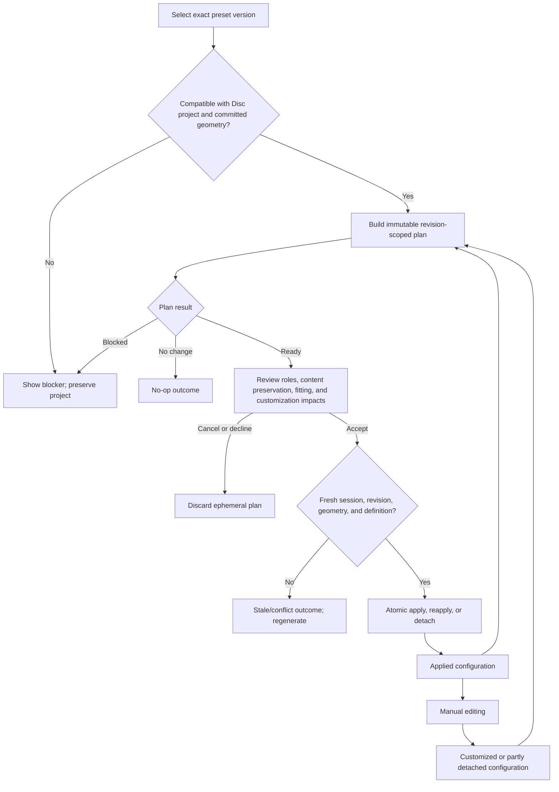

# Disc Layout Preset Workflow Contract
> Status: Draft target-state normative contract; not implemented as a complete application workflow.
> Purpose: Define application-level Disc Layout Preset identity, selection, planning, review, atomic application, persistent configuration, customization, reapplication, detachment, outcomes, and integration boundaries.
> Read when: Working on Disc Layout Preset catalogs, application, persistence, Game-import composition, Guided consumption, preset feedback/focus, or preset/template compatibility.
> Authoritative source: This document for target application-level Disc Layout Preset workflow semantics; current source and the SDD remain authoritative for as-built behavior; focused model, geometry, lifecycle, navigation, export, Game, and project-file documents retain the authorities assigned below.
> Last reviewed against commit: `f750a5c4b8721e6de4912a9be5ef26a05cddab5e`.

## 1. Status, scope, and authority

**TARGET REQUIREMENT —** This is the proposed normative contract for selecting,
planning, reviewing, applying, reapplying, and detaching a Disc Layout Preset.
It does not claim that immutable application-level plans, an atomic project
commit boundary, persistent generic preset configuration, typed command
dispatch, dirty derivation, or history integration are implemented today.

**TARGET REQUIREMENT —** A Disc Layout Preset is a named, stable, versioned
editing configuration that proposes deterministic semantic role/slot
assignments and layout actions within one valid committed Disc geometry. It is
not a physical template, custom-dimension set, rendered artwork layer,
export-only overlay, DOM-coordinate collection, project file, Game import,
Guided workflow, Case layout, or continuous layout solver.

| Claim class | Concern | Focused authority |
| --- | --- | --- |
| **TARGET REQUIREMENT** | Disc Layout Preset availability, selection, compatibility evaluation, immutable impact planning, review, atomic application, applied configuration, customization, reapplication, detachment, and preset outcomes | This contract |
| **TARGET REQUIREMENT** | Active session, canonical project snapshot, revision, path, baseline, dirty derivation, exclusive mutation capability, shared result envelope, global feedback, and future history | [`APPLICATION_COMMAND_AND_PROJECT_LIFECYCLE_CONTRACT.md`](APPLICATION_COMMAND_AND_PROJECT_LIFECYCLE_CONTRACT.md) |
| **TARGET REQUIREMENT** | Disc template selection, physical dimensions, last-valid geometry, geometry validation/planning/application, and geometry recovery | [`DISC_TEMPLATE_AND_PHYSICAL_GEOMETRY_WORKFLOW_CONTRACT.md`](DISC_TEMPLATE_AND_PHYSICAL_GEOMETRY_WORKFLOW_CONTRACT.md) |
| **TARGET REQUIREMENT** | Semantic control classification, workflow destinations, focus routing, editor navigation, contextual ownership, and presentation-adapter rules | [`EDITOR_NAVIGATION_AND_CONTROL_OWNERSHIP.md`](EDITOR_NAVIGATION_AND_CONTROL_OWNERSHIP.md) |
| **TARGET REQUIREMENT** | Game search, import planning/application, metadata discovery/application/editing, and Game outcomes | [`GAME_SEARCH_IMPORT_AND_METADATA_WORKFLOW_CONTRACT.md`](GAME_SEARCH_IMPORT_AND_METADATA_WORKFLOW_CONTRACT.md) |
| **TARGET REQUIREMENT** | Export orchestration, preflight, immutable export snapshot, rendering/encoding, destination safety, and export outcomes | [`EXPORT_WORKFLOW_CONTRACT.md`](EXPORT_WORKFLOW_CONTRACT.md) |
| **TARGET REQUIREMENT** | Serialized project fields, schema compatibility, normalization, and migrations | [`PROJECT_FILE_SPEC.md`](PROJECT_FILE_SPEC.md) |
| **TARGET REQUIREMENT** | Exact persisted Disc-template vocabulary and physical data meaning | [`TEMPLATE_SPEC.md`](TEMPLATE_SPEC.md) |
| **TARGET REQUIREMENT** | Packaging roles, generic preset-definition vocabulary, Guided slot/lifecycle vocabulary, and metadata-to-Disc-text binding | [`PACKAGING_ROLE_MODEL.md`](PACKAGING_ROLE_MODEL.md), [`ROLE_BASED_PRESET_MODEL.md`](ROLE_BASED_PRESET_MODEL.md), [`GUIDED_PRESET_SLOT_MODEL.md`](GUIDED_PRESET_SLOT_MODEL.md), and [`METADATA_DISC_TEXT_BINDING.md`](METADATA_DISC_TEXT_BINDING.md) |
| **TARGET REQUIREMENT** | Exact visual bounds, coordinate transforms, safe-zone calculations, contain/cover/crop primitives, text wrapping/fitting, grouped placement, clamps, and render transforms | Existing focused Disc layout, feature, text, preview, and export owners identified by the SDD |
| **FUTURE EXTENSION** | Guided Start orchestration, Case preset catalogs/structured layouts, generalized text fitting, and final application-menu presentation | Separate focused contracts or issue-scoped work |

**TARGET REQUIREMENT —** If an authority conflict appears, the narrow owner in
this table wins only for its assigned concern. This contract may coordinate
owner outputs, but it MUST NOT copy physical geometry, text-fitting, visual-
bounds, serialization, export, or navigation decisions into a parallel preset
implementation.

**TARGET REQUIREMENT —** Substantive claims use four classes: **CURRENT FACT**
for checkout-verified behavior, **TARGET REQUIREMENT** for normative target
behavior, **FUTURE EXTENSION** for deferred behavior, and **OPEN QUESTION** for
a narrow mechanism that does not weaken a mandatory semantic decision.

## 2. Terminology and semantic model

| Claim class | Term | Meaning |
| --- | --- | --- |
| **TARGET REQUIREMENT** | Preset definition | Immutable catalog data identified by stable preset ID and positive definition revision, containing compatibility, semantic slots, declared placement/fitting actions, and catalog metadata. |
| **TARGET REQUIREMENT** | Preset reference | Exact `{ presetId, definitionRevision }`; labels and compatibility aliases are never durable identity. |
| **TARGET REQUIREMENT** | Selected preset | Session-only candidate chosen for inspection. Selection grants no project authority. |
| **TARGET REQUIREMENT** | Compatibility evaluation | Pure classification of the exact definition against project kind, committed geometry, required adapters, and content prerequisites. |
| **TARGET REQUIREMENT** | Preset plan | Immutable, reviewable proposal bound to one session, project revision, committed geometry snapshot, preset version, current configuration, and owner-state snapshot. |
| **TARGET REQUIREMENT** | Role | Stable packaging purpose such as Game Title, Background Image, Company Logos, or Legal Info. |
| **TARGET REQUIREMENT** | Slot | Stable semantic position within a role/preset, distinct from a presentation card and from the object assigned to it. |
| **TARGET REQUIREMENT** | Assignment | Explicit relation among preset reference, role, slot, semantic placement target, stable feature-owner object identity, declared actions, and response policy. |
| **TARGET REQUIREMENT** | User content | Text, image, asset, metadata, source/provenance, selected mark, style, and user-created object data. A preset does not own it. |
| **TARGET REQUIREMENT** | Applied configuration | Canonical project state recording the exact preset reference, accepted options, stable assignments, association states, and customization information needed for later editing. |
| **TARGET REQUIREMENT** | Attached assignment | Assignment still eligible for its declared, event-scoped response policy. It is not continuously constrained. |
| **TARGET REQUIREMENT** | Customized assignment | Assignment whose preset-owned fields were manually changed or whose content/geometry relationship can no longer be represented as the accepted plan. Explicit project values win. |
| **TARGET REQUIREMENT** | Detached assignment/configuration | Preset association has no placement authority; current content, enablement, and explicit positions remain ordinary project state. |
| **TARGET REQUIREMENT** | Currentness | Derived runtime classification—`current`, `stale`, `incompatible`, or `unavailable`—computed from the saved reference/configuration, current catalog, committed geometry, object bindings, and project revision. It is not copied geometry. |
| **TARGET REQUIREMENT** | Reapply | Explicitly plan, review, and apply the same exact preset reference (or a separately reviewed migration) to selected attached/customized scopes. |
| **TARGET REQUIREMENT** | Detach | Explicitly remove preset authority from selected assignments or the whole configuration without deleting, reverting, disabling, or repositioning owner state. |

### Selection, plan, and applied-state matrix

| Claim class | Dimension | Selection | Reviewed plan | Applied configuration |
| --- | --- | --- | --- | --- |
| **TARGET REQUIREMENT** | Lifetime | Ephemeral/session | Ephemeral and revision-scoped | Canonical project state; persisted after schema work |
| **TARGET REQUIREMENT** | Identity | Candidate exact reference | Exact reference and definition digest | Exact reference plus accepted configuration |
| **TARGET REQUIREMENT** | Geometry | Compatibility summary only | One committed geometry snapshot/fingerprint | No copied physical geometry; retains only compatibility basis needed to detect staleness |
| **TARGET REQUIREMENT** | Roles/slots/objects | Catalog summary | Exact proposed bindings and actions | Accepted stable bindings and association states |
| **TARGET REQUIREMENT** | Customization | None | Existing customization impact disclosed | Per-assignment customization/detachment recorded when it affects later behavior |
| **TARGET REQUIREMENT** | Mutation/dirty | None | None | Changes canonical content only after successful atomic commit |
| **TARGET REQUIREMENT** | “Current” | Not applicable | Fresh or stale against captured inputs | Derived; never inferred only from coordinates |
| **TARGET REQUIREMENT** | Save/export | Excluded | Excluded | Explicit owner state saves/renders/exports; preset definition is not regenerated during output |

### Top-down workflow and state diagram

**TARGET REQUIREMENT —** The workflow follows this state sequence; presentation
may be inline or modal but may not collapse selection, review, and commit into
one semantic mutation.

**TARGET REQUIREMENT —** Catalog definition, selected candidate, reviewed plan,
applied configuration, owner content, explicit owner positions, Guided progress,
and physical template are separate state categories even where the current UI
uses related labels.

## 3. Verified current-state behavior

### Current-versus-target behavior matrix

| Claim class | Concern | Verified current behavior | Target correction |
| --- | --- | --- | --- |
| **CURRENT FACT** | Visible entry | Disc has one `Layout Presets` panel with a local `Choose a preset` select and explicit `Apply preset` button; Case Insert has no Disc preset panel. | Any presentation adapter invokes the five operations in section 5; final location is deferred. |
| **CURRENT FACT** | Catalog | The UI lists three legacy menu IDs: `classic-top-title`, `centered-logo-archive`, and `clean-metadata-footer`. Only Classic resolves to the canonical generic registry definition `builtin:disc-preset:classic-top-title@1`; the other two retain legacy update plans. | A small Disc-only catalog exposes validated stable references and version/compatibility metadata through one catalog owner. |
| **CURRENT FACT** | Selection | `selectedPresetId` is component-local, changes no project state, and resets after successful Apply. There is no separate app-level selection operation/result. | Selection is an explicit session-domain operation with availability and compatibility results. |
| **CURRENT FACT** | Planning/review | Generic Classic resolution/application produces immutable typed updates, but the visible workflow has no complete application-level impact plan, preservation review, stale token, or review step. Legacy presets have direct update plans. | One immutable complete plan covers all owner actions, preservation, fitting, compatibility, and customization impacts before mutation. |
| **CURRENT FACT** | Commit | `applyDiscRolePresetToOwners` computes next state, then dispatches multiple feature-owner setters sequentially. Registered Classic dispatches each touched family once; legacy plans may also dispatch feature clamps. There is no authoritative one-snapshot atomic project commit. | Apply/reapply/detach construct and validate one complete next project snapshot, then commit once or preserve the old snapshot. |
| **CURRENT FACT** | Content preservation | Classic emits placement-only updates, preserves content/enablement, leaves additional/repeated content untouched, and moves only selected enabled renderable OS marks. Legacy presets preserve content/sources but may explicitly enable renderable visuals and intended text rows. | Every enable/disable, create, replace, crop, or other material action must be declared in the plan; preservation is the default. |
| **CURRENT FACT** | Active behavior | Successful Classic application records transient exact ID/revision plus latest resolved definition. Direct layout edits do not refit. Semantic asset/content/style/mark-membership changes can target-refit only the affected Classic target. Legacy preset success clears the generic active state. | Persist attached/customized/detached associations and allow only declared, event-scoped responses for attached uncustomized targets; never run a continuous solver. |
| **CURRENT FACT** | Reapply/detach | Choosing Apply again is the only full reapplication route; it is not distinguished or reviewed as Reapply. No Detach operation exists. Feature resets remain feature-owned. | Reapply and Detach are explicit semantic operations with review, atomicity, customization handling, and typed outcomes. |
| **CURRENT FACT** | Persistence | Resulting feature layouts persist. Generic preset ID/revision/resolved geometry do not. Schema `0.2.0` separately persists guided layout identity/version plus omitted/completed slot IDs. Post-load reconstruction can recover transient Classic state only through that Guided mapping, without applying placement. | Persist the minimal canonical preset configuration required for later editing, separately from Guided state and definition/runtime geometry. |
| **CURRENT FACT** | Geometry/fitting | Classic uses canonical normalized regions, exact template resolution, production-equivalent visual bounds, contain fitting/group reflow, and measured Title/Legal text. It intentionally performs no broad post-fit clamp. The two legacy presets use fixed fields followed by current owner clamps. | All catalog entries declare one deterministic stage order and loss policy using focused geometry/bounds/fitting owners. |
| **CURRENT FACT** | Game/metadata | Steam import has no preset candidate or reviewed preset composition. Existing active Classic state can cause focused owner refits when import/metadata changes flow through semantic feature hooks. | Game planning may compose an explicit preset plan from this owner into one reviewed atomic import plan; discovery never silently applies a preset. |
| **CURRENT FACT** | Feedback/focus | Apply reports a status message; impossible Title/Legal fits receive focused messages. The panel uses labeled native select/button controls and Guided progress focus handling, but has no preset review/blocker focus contract. | Use lifecycle result/feedback ownership and the focus/accessibility matrix in section 16. |
| **CURRENT FACT** | Dirty/history/busy | No canonical preset-operation dirty/history contract or exclusive preset mutation scope exists in current App orchestration. | Canonical snapshot comparison, revision, exclusive mutation capability, and one future history transaction come from the lifecycle owner. |

**CURRENT FACT —** Current generic modules are deliberately layered:
`discPresetDefinition.ts` parses strict immutable catalog data,
`discPresetRegistry.ts` owns lookup/aliases, `discPresetResolution.ts` resolves
template-specific slots, trusted adapters own semantic translation,
`discPresetApplication.ts` creates immutable updates, focused app adapters
translate those updates, and feature owners remain preview/export/save truth.

**CURRENT FACT —** Current tests prove stable IDs, strict version/definition
parsing, deterministic immutable resolution/application order, exact-target
late application, content/enablement preservation, no Case or renderer/export
dependency in the pure engine, canonical visual-bounds fitting, save/load of
resulting owner geometry, Guided progress isolation, and safe unknown Guided
metadata handling. They do not prove the target atomic application-level
workflow or persistent generic customization model.

## 4. Preset identity, catalog, and compatibility

### Preset identity, catalog, and version matrix

| Claim class | Concept | Stable value | Compatibility rule | Persistence rule |
| --- | --- | --- | --- | --- |
| **CURRENT FACT** | Definition format | `kind: sbls/disc-preset`, `formatVersion: 1` | Strict parser rejects unknown format/fields | Definitions are catalog data, not project content |
| **CURRENT FACT** | Canonical preset ID | `builtin:disc-preset:<slug>`; future user namespace reserves UUID IDs | Compatibility aliases resolve only at the catalog boundary | Persist canonical ID, never alias or label |
| **CURRENT FACT** | Definition revision | Positive safe integer `revision` | Registry supports exact lookup and latest lookup | Current projects do not persist it as generic configuration |
| **TARGET REQUIREMENT** | Preset version | Semantic name for the exact definition revision used by a project | Saved references MUST use exact lookup; “latest” is for new browsing only | Project-file naming is owned by its schema, but semantic value is `definitionRevision` |
| **TARGET REQUIREMENT** | Catalog metadata | Stable ID/revision, name, description, Disc surface, source, format support, compatibility summary, required adapters, and availability | Catalog validates before exposure; labels may change without identity changes | Do not copy the whole definition into each project |
| **TARGET REQUIREMENT** | Applied configuration version | Exact preset ID + definition revision + accepted configuration contract version if later needed | Never infer from coordinates, slot count, label, Guided version, or project schema version | Persist only through an explicit project-schema change |

**TARGET REQUIREMENT —** `formatVersion`, preset definition revision, project
schema version, Guided layout version, app version, and physical template ID are
separate namespaces. A focused compatibility mapping MAY relate them, but
numeric equality is never an implicit rule.

**TARGET REQUIREMENT —** The first implementation MUST expose a small validated
Disc-only catalog. This document does not choose its final entries. Definitions
MUST live in the focused catalog/preset domain rather than in `App.tsx`, a
presentation component, renderer, or duplicated menu array. Transitional legacy
entries require explicit adapter/compatibility status and may not masquerade as
fully generic definitions.

### Availability and compatibility matrix

| Claim class | Availability state | Meaning | Planning consequence |
| --- | --- | --- | --- |
| **TARGET REQUIREMENT** | `available` | Exact definition and every mandatory adapter/format capability are present | Continue to geometry/content compatibility |
| **TARGET REQUIREMENT** | `migration-available` | Saved version is understood by a reviewed deterministic definition/config migration | Plan migration separately and disclose it; never silently select latest |
| **TARGET REQUIREMENT** | `unknown-preset` | Canonical ID is not recognized | Preserve project and explicit placements; offer Detach or install/recover definition |
| **TARGET REQUIREMENT** | `version-unavailable` | ID exists but exact revision is absent and no migration is declared | Preserve project; block apply/reapply, not load/preview/save/export |
| **TARGET REQUIREMENT** | `invalid-definition` | Catalog validation failed | Hide/disable new selection and return stable diagnostics |
| **TARGET REQUIREMENT** | `unsupported-capability` | Required semantic target/adapter is unavailable | Block or mark optional targets according to the definition; never silently reinterpret |

**TARGET REQUIREMENT —** Compatibility evaluation covers project kind, exact
definition version, committed Disc geometry, slot/adapter support, required
content policy, stable object bindings, and declared fitting/loss rules. It MUST
NOT choose a template, repair geometry, fetch content, or mutate feature state.

## 5. Workflow entry and semantic operations

**TARGET REQUIREMENT —** The application-level registry contains exactly these
five semantic operation IDs:

- `disc.layoutPreset.select`
- `disc.layoutPreset.plan`
- `disc.layoutPreset.apply`
- `disc.layoutPreset.reapply`
- `disc.layoutPreset.detach`

### Semantic operation registry

| Operation ID | Owner | Principal inputs | Mutability | Busy scope | Stale policy | Typed result values | Allowed presentation adapters |
| --- | --- | --- | --- | --- | --- | --- | --- |
| `disc.layoutPreset.select` | Disc preset workflow session owner | Session/project kind, catalog candidate/ref, current selection | Session-only | None; latest selection replaces prior selection | Project replacement clears it; catalog refresh re-evaluates availability | `selection-available`, `unknown-preset`, `version-unavailable`, `unsupported-project-kind`, `cancelled` | Current/future Disc panel, application menu, Game review, Guided Start |
| `disc.layoutPreset.plan` | Disc preset workflow domain owner | Exact selection or current config, operation mode, canonical snapshot, session ID/revision, committed geometry, owner snapshots, accepted options | Pure/ephemeral | Replaceable `disc.layoutPreset.plan` | Any captured session/revision/geometry/catalog/options/owner change invalidates | `plan-available`, `no-op`, `blocked`, `superseded`, `stale` | Review host invoked by standalone, Game, or Guided adapter |
| `disc.layoutPreset.apply` | Exclusive project mutation boundary | Fresh accepted Apply plan and authorization | Canonical atomic mutation | `project.mutation` plus preset-apply capability | Recheck every freshness token immediately before commit | `applied`, `no-op`, `declined`, `stale`, `conflict`, `failure` | Same adapters; no private setter route |
| `disc.layoutPreset.reapply` | Exclusive project mutation boundary | Fresh accepted Reapply plan, exact current/saved ref, selected assignment scope, customization-overwrite consent | Canonical atomic mutation | `project.mutation` plus preset-apply capability | Same as Apply; customized scope/consent is part of freshness | `reapplied`, `no-op`, `declined`, `stale`, `conflict`, `failure` | Applied-configuration controls, Game/Guided only through explicit review |
| `disc.layoutPreset.detach` | Exclusive project mutation boundary | Fresh accepted Detach-mode plan, current configuration, full or assignment scope | Canonical atomic association mutation; owner content/layout preserved | `project.mutation` plus preset-apply capability | Recheck configuration identity, revision, and scope | `detached`, `no-op`, `declined`, `stale`, `conflict`, `failure` | Applied-configuration controls or lifecycle-safe menu adapter |

**TARGET REQUIREMENT —** Presentation controls dispatch operation IDs and typed
inputs; they do not own compatibility, role mapping, plan construction, fitting,
mutation, result reinterpretation, or dirty state. A focused owner-local
response to an attached role's semantic content replacement is not a sixth
application-level command and MUST obey the stored response policy in section
11.

**TARGET REQUIREMENT —** Opening, browsing, selecting, comparing, cancelling,
or closing the workflow abandons only ephemeral state. Return Home retains the
active project under the lifecycle contract but abandons unretained selection
and plans. If a product later retains a plan across Resume, it MUST revalidate
session, revision, geometry, definition version, configuration, and options.

## 6. Selection, planning, and review

**TARGET REQUIREMENT —** Selection MUST resolve an exact available catalog
reference before planning and MUST NOT change the project, feature enablement,
Guided progress, preview output, path, baseline, or dirty state. An unavailable
selection returns typed compatibility information and remains safely
abandonable.

**TARGET REQUIREMENT —** One preset plan is an immutable value containing at
least:

- operation mode (`apply`, `reapply`, or `detach`), plan/session identity, base
  project revision, project kind, and canonical snapshot identity;
- exact preset ID, definition revision, definition/registry digest or equivalent
  freshness token, catalog source, and compatibility result;
- one valid committed Disc geometry identity/fingerprint and geometry summary;
- current applied/customized/detached configuration and selected scope;
- stable role IDs, slot IDs, semantic targets, stable owner/object IDs, ordered
  assignment actions, and declared event-response policies;
- before/after summaries for every preset-owned placement, size, fitting,
  enablement, association, and configuration field;
- actual authoritative visual-bounds inputs and their provenance/status;
- explicit contain/cover/crop/scale/clamp/reflow policies, computed bounds,
  limiting axes, and any lossy adjustment;
- required/optional content and asset prerequisites, missing/unsupported state,
  and any explicit creation proposal;
- preserved content, metadata, sources, assets, enablement, layouts, styles,
  unknown objects, and untargeted owner state;
- current customization/detachment impacts, overwrite scope, and required
  consent;
- warnings, blockers, diagnostics, no-op reason, deterministic after-state or
  pure data sufficient to construct it, and cleanup handles for staged
  resources if any; and
- provenance linking each action to the definition, assignment, focused owner,
  and accepted user choice.

**TARGET REQUIREMENT —** Plans MUST NOT contain live setters, mutable React
references, DOM nodes, component IDs, array indexes as durable identity,
unresolved network operations, renderer-only values, or instructions to
re-discover data during apply.

### Plan-status matrix

| Claim class | Plan status | Review behavior | Mutation behavior |
| --- | --- | --- | --- |
| **TARGET REQUIREMENT** | `ready` | Show all material role/slot, enablement, fitting, content-preservation, and customization impacts | May be accepted, then freshness-checked |
| **TARGET REQUIREMENT** | `no-op` | Explain that current canonical state already equals the proposed result | No commit, revision, dirty, or history change |
| **TARGET REQUIREMENT** | `blocked` | Identify every blocker and first actionable recovery | Apply controls disabled; project unchanged |
| **TARGET REQUIREMENT** | `stale`/`superseded` | Explain that inputs changed and offer regeneration | Old plan is never applied |

**TARGET REQUIREMENT —** Review MUST make explicit any enable/disable, missing
required content, content creation, replacement, crop, clamp, reflow, geometry
incompatibility, customized-field overwrite, detached assignment inclusion, or
definition-version migration. Optional unavailable content MAY be skipped only
when the definition declares it optional and the plan records the skip.

**TARGET REQUIREMENT —** Applying a new preset while another configuration is
present is replacement of preset association, not deletion of content. The plan
MUST show which old associations become detached, which explicit owner values
change, and which remain preserved.

## 7. Atomic application and session effects

**TARGET REQUIREMENT —** Apply and Reapply MUST construct a complete candidate
canonical project snapshot from the accepted plan, validate it, recheck
freshness, and commit it through one project/session mutation boundary. Detach
MUST do the same for association/configuration changes. No observer may see new
preset identity paired with old placement or a subset of owner updates.

**TARGET REQUIREMENT —** A partial application-plan result is not permission to
partially commit. Optional skipped actions are explicit members of one complete
accepted plan; every non-skipped action either commits together or the prior
project remains unchanged. Unexpected owner/commit failure MUST roll back or
fail before publishing the candidate.

### Persistence, dirty, and history matrix

| Claim class | Session field/effect | Successful semantic change | No-op/cancel/decline/stale/failure |
| --- | --- | --- | --- |
| **TARGET REQUIREMENT** | Canonical project content | Replace once with complete validated after-state | Unchanged |
| **TARGET REQUIREMENT** | Revision | Advance exactly once | Unchanged |
| **TARGET REQUIREMENT** | Project path | Unchanged | Unchanged |
| **TARGET REQUIREMENT** | Clean baseline | Unchanged | Unchanged |
| **TARGET REQUIREMENT** | Dirty | Re-derived by canonical snapshot comparison | Unchanged except for unrelated current state |
| **TARGET REQUIREMENT** | Save/write | Not invoked | Not invoked |
| **TARGET REQUIREMENT** | Export | Not invoked | Not invoked |
| **TARGET REQUIREMENT** | Guided progress | Changed only by an explicitly composed Guided transition, never as an implicit preset side effect | Unchanged |
| **TARGET REQUIREMENT** | Feedback | One accessible operation result, without claiming Save/Export | Neutral/actionable according to section 16 |
| **TARGET REQUIREMENT** | Future history | One transaction containing all project changes | No transaction |

**TARGET REQUIREMENT —** Apply/reapply/detach MUST NOT expose feature setters as
the semantic commit API. Existing owner adapters remain responsible for pure
normalization and after-state construction; the lifecycle/project owner commits
the resulting aggregate.

**TARGET REQUIREMENT —** No preset operation sets a scattered dirty boolean,
writes a file, changes the current path, updates the clean baseline, or marks a
project clean. New/Open/Close/Quit guards depend on derived canonical dirty
state, not on an ephemeral selection or plan. Project replacement invalidates
selection and plans from the old session. Save and Export capture immutable
committed snapshots and cannot observe a half-applied preset.

**TARGET REQUIREMENT —** Cancellation before commit discards the plan and staged
resources. After the atomic commit boundary begins, cancellation cannot expose
a partial snapshot: the commit finishes or preserves/restores the complete
prior snapshot.

## 8. Role, slot, and content ownership

### Role, slot, and content ownership matrix

| Claim class | Layer | Owns | Does not own | Stable identity requirement |
| --- | --- | --- | --- | --- |
| **TARGET REQUIREMENT** | Packaging role model | Semantic purpose and role taxonomy | Project object, placement, UI panel, content | Stable role-domain ID |
| **TARGET REQUIREMENT** | Preset definition | Ordered semantic slots, target kinds, compatibility, placement/fitting intent, optional/required policy | User assets/text/metadata, owner state, DOM, Guided progress | Stable preset ID/revision + stable slot ID |
| **TARGET REQUIREMENT** | Applied assignment | Accepted relation from role/slot/target to an existing feature-owner object and response policy | Duplicate owner payload or copied renderer state | Stable object/element ID; never array index |
| **TARGET REQUIREMENT** | Feature owner | Actual asset/text/mark, source, enablement, layout, style, rendering, export, reset/clear, and project normalization | Preset catalog or workflow review | Existing owner identity; add stable IDs before repeatable binding |
| **TARGET REQUIREMENT** | User content | User-authored/imported value and provenance | Slot geometry or preset compatibility | Existing project/asset identity |
| **TARGET REQUIREMENT** | Guided workflow | Expected-content lifecycle, omission/completion, placeholder projection, setup navigation | Preset application/configuration or content | Guided layout/version/slot IDs in its namespace |
| **TARGET REQUIREMENT** | Presentation | Labels, descriptions, selection/review controls, typed dispatch, result projection | Role meaning, mappings, state transitions, bounds, fitting, mutation | Semantic destination/control IDs from navigation owner |

### Disc role/slot/content matrix

| Claim class | Role/family | First-target assignment policy | Missing optional content | Missing required content | User-created/repeatable content |
| --- | --- | --- | --- | --- | --- |
| **TARGET REQUIREMENT** | Background Image | Bind only the existing primary background owner; preset may change declared placement/fit | Preserve owner; skip/warn | Warn/block only if definition explicitly marks required | No invented artwork |
| **TARGET REQUIREMENT** | Game Title artwork/text | Bind explicit artwork and/or text targets according to reviewed priority; never infer both as content replacement | Keep dormant placement only when owner supports it and plan discloses it | Warn/block per definition; no invented title | Preserve content and manual source priority |
| **TARGET REQUIREMENT** | Rating/Media/OS/Technical marks | Keep families and primary/group slots distinct | Skip/warn; never invent a mark/value | Warn/block per declared slot | Stable mark identity and canonical group order; preserve unassigned marks |
| **TARGET REQUIREMENT** | Developer/Publisher/Additional logos | Keep Developer and Publisher primary assignments distinct | Skip/warn | Warn/block per definition | Additional logos require stable object IDs and explicit repeatable policy; never borrow primary placement |
| **TARGET REQUIREMENT** | Legal and other Disc text | Bind fixed semantic text rows to focused text-layout owners | Keep content/enablement; skip/warn | Warn/block; do not invent legal copy | Arbitrary text creation remains outside first target |
| **TARGET REQUIREMENT** | Additional Artwork/Additional Text | Only target an existing stable object/fixed row explicitly declared by the definition | Preserve untouched | Definition cannot make unsupported arbitrary objects required | Unknown/extra objects are always preserved |

**TARGET REQUIREMENT —** The first implementation MUST NOT create missing user
content or repeatable objects. A future definition format MAY propose a new
empty configuration object only when the plan shows the creation, assigns a
stable ID/provenance, obtains required consent, and leaves it as ordinary owner
state after Detach. A preset MUST never invent metadata, text, asset bytes,
rating values, or private Guided bindings.

**TARGET REQUIREMENT —** Presentation/navigation role IDs may be adapters, but
they are not automatically durable preset IDs. Persisted associations require
an intentional stable domain mapping.

## 9. Content preservation and feature enablement

### Content-preservation and enablement matrix

| Claim class | State category | Default Apply/Reapply behavior | Allowed exception | Detach behavior |
| --- | --- | --- | --- | --- |
| **TARGET REQUIREMENT** | Images/assets/data URLs | Preserve exact value and provenance | Explicit reviewed replacement action from another owner workflow | Preserve |
| **TARGET REQUIREMENT** | Text/HTML/metadata/manual source | Preserve exact content and source mode | Explicit reviewed content action; preset definitions normally own no content | Preserve |
| **TARGET REQUIREMENT** | Selected rating/media/platform/technical values | Preserve | Explicit reviewed selection action only if a future definition format owns it | Preserve |
| **TARGET REQUIREMENT** | Enablement/visibility | Preserve | Explicit preset action shown in plan; disabled payload remains intact | Preserve current value; never enable/disable |
| **TARGET REQUIREMENT** | Placement/size/text layout | Change only declared accepted preset-owned fields | Focused owner may reject/block an unsafe or impossible result | Preserve current explicit value |
| **TARGET REQUIREMENT** | Style/frame/theme/source/crop | Preserve | Explicit declared and reviewed action; crop/loss requires consent | Preserve |
| **TARGET REQUIREMENT** | Untargeted roles/unknown objects | Preserve by identity and value | None in first target | Preserve |
| **TARGET REQUIREMENT** | Guided omission/completion | Preserve | Separately composed Guided transition only | Preserve |

**TARGET REQUIREMENT —** Non-destructive means more than retaining asset bytes:
the plan MUST prove preservation of content, object identity, source/provenance,
manual overrides, feature enablement, unassigned layout, styles, custom images,
selected values, repeated objects, unknown future fields, metadata, and Guided
progress except where one explicit reviewed action says otherwise.

**TARGET REQUIREMENT —** A preset MUST NOT silently delete, clear, replace,
disable, enable, crop, reset, change source, change metadata, or reassign user
content. A definition that requests enablement owns only the boolean transition,
not the retained disabled payload. A definition that requests placement owns
only the listed layout fields, not the content assigned to them.

**TARGET REQUIREMENT —** Unavailable optional content is an informational or
warning skip. Missing required content follows the definition's declared
warning/blocker policy. An action that cannot preserve content or would require
undisclosed loss is a blocker, not a best-effort mutation.

## 10. Deterministic placement, fitting, clamping, and reflow

**TARGET REQUIREMENT —** Preset placement uses canonical normalized Disc
coordinates and one valid committed physical geometry snapshot. Given the same
definition revision, accepted options, geometry, owner content/bounds, and base
project state, planning MUST produce the same ordered actions and semantically
equal after-state. Applying that after-state again MUST yield a semantic no-op.

### Placement, fitting, clamp, and reflow matrix

| Claim class | Stage | Focused owner/input | Required result | Forbidden shortcut |
| --- | --- | --- | --- | --- |
| **TARGET REQUIREMENT** | Slot resolution | Preset resolver + committed geometry | Nominal and resolved canonical slot/action regions, compatibility diagnostics | DOM pixels, preview element lookup, or template mutation |
| **TARGET REQUIREMENT** | Assignment | Preset workflow + role/slot/object registry | Stable target-to-owner/object binding and missing-content disposition | UI label, array index, broad owner guess |
| **TARGET REQUIREMENT** | Visual bounds | Feature/render/text owner | Actual canonical painted/rendered bounds at declared baseline, including offsets/rotation/stroke/shadow where output includes them | Generic placeholder dimensions unless that fallback is the actual normal renderer |
| **TARGET REQUIREMENT** | Placement | Focused preset adapter | Canonical anchor/center/rotation/group order and declared layout fields | Viewport, zoom, DPR, event order, or render-order dependence |
| **TARGET REQUIREMENT** | Proportional scaling | Shared/focused fit primitive | Uniform scale preserving aspect ratio | Stretching |
| **TARGET REQUIREMENT** | Contain | Focused fit primitive | Entire authoritative bounds within declared region/inset; limiting axis disclosed | Undeclared crop or post-fit shrink |
| **TARGET REQUIREMENT** | Cover | Background/image owner | Region covered with declared crop/focal behavior | Calling cover “contain” or hiding crop |
| **TARGET REQUIREMENT** | Crop | Image owner | Exact accepted crop/focal loss recorded in plan | Silent destructive crop |
| **TARGET REQUIREMENT** | Clamp | Geometry/layout owner | Deterministic correction to a declared hard boundary, reported if it changes planned output | Broad after-the-fact clamp that invalidates reviewed placement |
| **TARGET REQUIREMENT** | Reflow/grouping | Focused group/text owner | Deterministic membership/order/gap/wrap/row result and union bounds | Independent overlapping point guesses |
| **TARGET REQUIREMENT** | Render clipping | Preview/export renderer | Apply physical Disc clipping consistently to committed owner state | Treat clipping as proof that unsafe placement is acceptable |

**TARGET REQUIREMENT —** The normative order is: validate committed geometry;
resolve slots; bind roles/objects; acquire authoritative bounds; compute
placement; apply the declared fit/scale/crop policy; perform only declared
clamp/reflow; validate final bounds/non-overlap/readability; record the exact
after-state and diagnostics; then commit. A later clamp MUST NOT silently change
an already reviewed fit.

**TARGET REQUIREMENT —** Images use actual content-aware preview/export bounds.
Multi-item roles use a deterministic canonical order, per-item aspect ratios,
declared fixed/scaled gaps, and final union bounds. Rotation uses the focused
owner's rotated bounds. Missing dimensions produce a skip/warning/blocker or
explicit dormant placement; they never cause invented dimensions.

**TARGET REQUIREMENT —** Text owners retain wrapping, line breaking, rich-run
measurement, typography, straight/curved geometry, truncation policy, and
minimum readability. A preset supplies the region and declared intent; it does
not implement another text fitter. Any truncation, minimum-size breach, or
overflow is a reviewable warning/blocker according to the text owner and
definition.

**CURRENT FACT —** Classic already uses rectangle-authoritative contain fitting
for its applicable images/groups and measured Title/Legal text, with production-
equivalent canonical bounds and no broad post-fit annulus/hole clamp. Legacy
presets still use fixed layout updates and feature clamps. The target requires
one explicit stage contract for every catalog definition rather than erasing
the proven Classic geometry.

## 11. Manual customization, reapplication, and detachment

### Customization, reapply, and detach matrix

| Claim class | Event | Association/configuration result | Placement/content result | Required next behavior |
| --- | --- | --- | --- | --- |
| **TARGET REQUIREMENT** | Direct drag, x/y/scale/width/rotation/fit edit of assigned target | Mark affected assignment `customized`; configuration becomes `customized` | User's explicit value wins | No automatic snap-back; Reapply requires review |
| **TARGET REQUIREMENT** | Manual content/style change affecting bounds while assignment remains attached and uncustomized | Keep attached only if accepted response policy covers that exact event | Focused target may deterministically refit within the same slot | Record result atomically; no unrelated target moves |
| **TARGET REQUIREMENT** | Same event after manual placement customization | Remain customized | Preserve manual placement; focused owner may report fit risk | Offer reviewed Reapply or Detach; do not overwrite |
| **TARGET REQUIREMENT** | Asset/source replacement or first valid asset | Follow declared `static` or exact-target response policy | If responsive and uncustomized, refit only that assignment; otherwise preserve | Never full-preset reapply |
| **TARGET REQUIREMENT** | Group membership change | Follow declared group response policy | Reflow only attached uncustomized group, in canonical order | Customized group requires review |
| **TARGET REQUIREMENT** | Explicit Reapply | Preserve exact current content; selected customized fields may be overwritten only with consent | Apply reviewed current definition actions atomically | Update configuration/customization markers from accepted result |
| **TARGET REQUIREMENT** | Detach selected assignment | Assignment becomes detached; overall configuration is customized unless all are detached | Preserve exact content, enablement, and placement | Disable all future preset response for that assignment |
| **TARGET REQUIREMENT** | Detach whole configuration | Configuration state becomes `detached` with zero placement authority | Preserve every owner value | May later plan Reapply from retained exact reference if compatible |
| **TARGET REQUIREMENT** | Feature Reset/Clear | Remains a feature-owner operation | Existing owner semantics apply | Does not mean Reapply or Detach unless separately invoked |
| **TARGET REQUIREMENT** | Apply different preset | Old associations are detached/replaced only as shown in plan | Preserve content; change accepted fields only | Commit one new configuration atomically |

**TARGET REQUIREMENT —** Allowed response policies are declarative and event-
scoped, for example `static`, `refit-on-semantic-bounds-change`, or
`reflow-on-membership-change`. They are recorded by assignment/configuration,
use the same focused pure adapter as planning, and run only for an attached,
uncustomized target. React effects, coordinate watchers, render observers, and
continuous solvers MUST NOT enforce a preset.

**TARGET REQUIREMENT —** Reapply is not a hidden consequence of loading,
metadata change, template change, editor entry, preview render, or export. It
uses `disc.layoutPreset.plan` in Reapply mode, discloses every customized or
detached field it proposes to restore, and requires explicit accepted scope.

**TARGET REQUIREMENT —** Detach is neither Delete nor Reset. It MUST NOT revert
to pre-preset coordinates, restore catalog defaults, remove a created object,
disable a feature, change content, or clear Guided progress. A future “restore
pre-preset state” feature would require a separate reviewed recovery/history
contract.

## 12. Persistence and incompatible preset recovery

**CURRENT FACT —** Schema `0.2.0` persists feature-owned resulting positions and
a separate `editor.guidedLayout` identity/version with omitted/completed slots.
It does not persist generic preset ID/revision, resolved definitions, role
assignments, manual customization, or detachment. Valid Guided identity can
reconstruct transient Classic policy after load without dispatching placement.

**TARGET REQUIREMENT —** A future project schema MUST persist only preset state
that affects later editing:

| Claim class | Semantic field | Persistence rule |
| --- | --- | --- |
| **TARGET REQUIREMENT** | Exact preset reference | Canonical ID + exact definition revision; project-spec chooses JSON field names |
| **TARGET REQUIREMENT** | Configuration lifecycle | `applied`, `customized`, or `detached` |
| **TARGET REQUIREMENT** | Accepted options/policies | Only stable values needed to interpret later behavior |
| **TARGET REQUIREMENT** | Assignments | Stable role/slot/target/object identities and attached/customized/detached association state |
| **TARGET REQUIREMENT** | Customization facts | Minimal per-assignment categories/scopes needed to prevent silent overwrite and explain Reapply |
| **TARGET REQUIREMENT** | Compatibility basis | Minimal stable template/geometry/configuration fingerprint needed to derive currentness; never copied resolved geometry |
| **TARGET REQUIREMENT** | Explicit owner state | Continues through existing feature-owned fields and remains visual truth |
| **TARGET REQUIREMENT** | Excluded data | Catalog definition copy, resolved slot geometry, calculated bounds, plan/review state, selection, diagnostics, busy/focus/menu state, DOM/smoke IDs, labels, array indexes |

**TARGET REQUIREMENT —** The exact serialized shape, schema version, migration,
validation, and normalization belong to `PROJECT_FILE_SPEC.md` and are not
implemented by this documentation pass. A migration from a project with no
generic configuration MUST invent neither a preset identity nor customization
history from coordinates or Guided progress.

### Persisted compatibility and recovery matrix

| Claim class | Load condition | Configuration recovery | Owner content/positions | Apply/reapply availability |
| --- | --- | --- | --- | --- |
| **TARGET REQUIREMENT** | Exact definition/version available and compatible | Restore configuration/associations, then derive current/customized state | Restore explicit saved values first; never regenerate | Available through a new plan |
| **TARGET REQUIREMENT** | Exact version missing; approved migration exists | Preserve old config, offer/plan deterministic migration with disclosure | Preserve | Block Reapply until migration accepted |
| **TARGET REQUIREMENT** | Unknown preset ID or unavailable version | Retain typed unavailable configuration or safely detach by explicit action | Preserve and continue preview/save/export | Block Apply/Reapply; offer recovery/Detach |
| **TARGET REQUIREMENT** | Geometry now incompatible | Retain config/reference and classify incompatible/stale | Preserve valid normalized explicit values | Block Reapply until compatible geometry/plan; no template switch |
| **TARGET REQUIREMENT** | Assigned object missing | Mark assignment unresolved; do not bind by array position or label | Preserve all remaining objects | Warn/block according to required/optional policy |
| **TARGET REQUIREMENT** | Malformed preset metadata | Quarantine/drop only invalid preset metadata under project-spec normalization | Restore project whenever safe | Report recoverable diagnostic; do not reject otherwise valid design solely for preset metadata |
| **TARGET REQUIREMENT** | Detached configuration | Restore detached record with zero response authority | Restore exactly | May plan explicit Reapply if definition is available |

**TARGET REQUIREMENT —** Load order is: parse/migrate/normalize project; restore
committed template and explicit feature-owner state; restore normalized preset
configuration; resolve exact catalog compatibility and bindings; derive
currentness; restore presentation. Loading MUST NOT reapply, refit, reclamp, or
replace explicit positions merely because a preset reference exists.

## 13. Geometry, preview, save, and export boundaries

### Preset-versus-physical-template matrix

| Claim class | Concern | Disc physical template/geometry | Disc Layout Preset |
| --- | --- | --- | --- |
| **TARGET REQUIREMENT** | Identity | Template ID + valid physical dimensions | Stable preset ID + definition revision |
| **TARGET REQUIREMENT** | Purpose | Define printable Disc, holes, safe/print boundaries, guides | Arrange semantic content within committed geometry |
| **TARGET REQUIREMENT** | Selection/apply | Geometry workflow contract | This contract |
| **TARGET REQUIREMENT** | Validation | Physical invariants and last-valid geometry | Project/surface/version/adapter/content/fitting compatibility |
| **TARGET REQUIREMENT** | Project state | Persisted template/custom dimensions | Future persisted applied configuration + explicit owner state |
| **TARGET REQUIREMENT** | Recovery | Geometry restore under geometry contract | Reapply/Detach; no geometry repair |
| **TARGET REQUIREMENT** | Output | Supplies physical render/export geometry | Supplies no export-time layout regeneration |

### Geometry compatibility matrix

| Claim class | Geometry condition | Plan result | Existing configuration behavior |
| --- | --- | --- | --- |
| **TARGET REQUIREMENT** | Valid committed geometry; definition compatible | Resolve deterministic slots and continue | May be current or customized |
| **TARGET REQUIREMENT** | Valid geometry; optional slot cannot resolve | Explicit optional skip/warning | Preserve assignment/content; mark affected compatibility as needed |
| **TARGET REQUIREMENT** | Valid geometry; required slot/fit impossible | Block or require declared reviewable alternative | Preserve project/configuration |
| **TARGET REQUIREMENT** | Invalid/uncommitted raw custom draft | No preset planning against draft | Continue using last valid committed geometry |
| **TARGET REQUIREMENT** | Geometry plan under review | Preset planning remains bound to old committed geometry and becomes stale if geometry commits | Geometry workflow reports preset impact but does not apply preset |
| **TARGET REQUIREMENT** | Geometry changed successfully | Re-evaluate currentness; mark configuration customized/stale/incompatible as appropriate | Preserve reference, assignments, content, and geometry-adjusted explicit values; never silently reapply/discard |

**TARGET REQUIREMENT —** A preset plan consumes one valid committed geometry
snapshot from the geometry owner. It MUST NOT choose a template, set custom
dimensions, clamp an invalid draft into validity, call private geometry setters,
or treat DOM/preview dimensions as physical truth.

### Preview, save, and export consumer matrix

| Claim class | Consumer | Accepted inputs | Must ignore | Missing-definition behavior |
| --- | --- | --- | --- | --- |
| **TARGET REQUIREMENT** | Committed live preview | Current explicit feature-owner state + committed physical geometry | Unaccepted selection/plan and catalog regeneration | Render valid explicit state |
| **FUTURE EXTENSION** | Provisional plan preview | Read-only plan after-state through normal render adapters, visually distinguished and text-summarized | Mutation, hidden DOM measurement as authority, export | May be unavailable; review remains text-complete |
| **TARGET REQUIREMENT** | Save/Save As | One immutable canonical snapshot after commit | Selection, plan, resolved catalog geometry, busy/focus state | Save valid explicit state/config recovery metadata per project spec |
| **TARGET REQUIREMENT** | Export/preflight | One immutable committed project snapshot and physical geometry | Preset catalog lookup/reapply, unaccepted plan preview, Guided placeholder | Export valid explicit owner state; missing definition alone does not block |
| **TARGET REQUIREMENT** | Clean PNG renderer | Existing owner layout/content and export adapters | Preset ID as render instruction | Never regenerate layout from preset |

**TARGET REQUIREMENT —** Zoom, pan, viewport dimensions, DOM size, device-pixel
ratio, focus, sidebar state, and render order MUST NOT affect preset planning or
committed canonical coordinates. Preview and export consume the same explicit
project result; the preset catalog is not another renderer.

## 14. Game import, metadata, and Guided Start integration

### Standalone, Game, and Guided application matrix

| Claim class | Entry | May select/recommend | Planning owner | Commit boundary | Must not own |
| --- | --- | --- | --- | --- | --- |
| **TARGET REQUIREMENT** | Standalone Disc editor | User selects an available Disc preset | `disc.layoutPreset.plan` | Preset Apply/Reapply/Detach through lifecycle mutation | Geometry, content discovery, export |
| **TARGET REQUIREMENT** | Game import review | User explicitly selects a preset or `preserve`; discovery may recommend without applying | Game plan composes the immutable preset plan from this owner | One atomic composed Game import after-state; no sequential private preset Apply | Preset catalog, compatibility, fitting semantics, or silent default selection |
| **FUTURE EXTENSION** | Guided Start | May recommend and dispatch Select/Plan/Apply after explicit review | Same preset owner; Guided owns orchestration/progress only | One accepted lifecycle-coordinated project commit | Preset definitions/application semantics, content owners, physical geometry |
| **CURRENT FACT** | Current Steam import | No import-time preset choice; active Classic can exact-target refit through semantic feature hooks | Existing import/feature paths | Multiple current owner updates, not target composed plan | No generic workflow composition today |

**TARGET REQUIREMENT —** Game search, candidate discovery, and metadata discovery
are non-mutating. A Game import plan that includes a preset MUST embed or
reference one fresh immutable preset subplan with all role/slot, enablement,
fitting, preservation, and customization impacts. Game apply constructs one
combined after-state and commits once; it MUST NOT call a private preset setter
sequence before or after import.

**TARGET REQUIREMENT —** Metadata does not silently select or fully reapply a
preset. When accepted metadata changes canonical bound text or a generated mark,
the composed plan follows the assignment's declared response policy. An
attached, uncustomized responsive assignment MAY deterministically refit only
that exact target. A customized/detached assignment preserves manual placement
and reports any fit risk or Reapply option. Metadata/manual source semantics
remain owned by the Game and metadata-binding/text owners.

**TARGET REQUIREMENT —** Guided layout identity, omission, completion, owner-
filled lifecycle, and placeholder navigation remain separate from applied
preset configuration. Applying a preset MAY provide a compatible definition to
a separately accepted Guided activation, but “preset applied,” “slot filled,”
and “guided complete” are never synonymous.

**TARGET REQUIREMENT —** Dependency order is physical geometry contracts first,
then this preset workflow, then future Guided Start composition, then focused
Case preset/structured-layout contracts, then final menu/presentation decisions.
Blank Project remains available without a preset or Guided checklist.

## 15. Disc/Case and presentation-adapter boundaries

**TARGET REQUIREMENT —** This contract is Disc-only. Case Front, Case Back/Tray,
left spine, and right spine have distinct rectangular geometry, roles, fitting,
text, save/load, preview, and export owners. No Disc preset may target or mutate
Case state, and no Disc compatibility result implies Case support. The
Case-specific sibling protocol and its explicit design-region/coordinate-basis
rules are owned by
[`CASE_INSERT_LAYOUT_PRESET_WORKFLOW_CONTRACT.md`](CASE_INSERT_LAYOUT_PRESET_WORKFLOW_CONTRACT.md).

### Disc/Case and presentation-adapter matrix

| Claim class | Concern | Shared infrastructure allowed | Editor-specific authority required |
| --- | --- | --- | --- |
| **TARGET REQUIREMENT** | Operation/result envelope | Neutral dispatch, capability, diagnostics, feedback primitives | Disc operation registration and preset semantics here; Case semantics in the Case sibling contract |
| **TARGET REQUIREMENT** | Catalog primitives | Stable identity/version parsing and storage-neutral registry interfaces | Disc definition vocabulary/adapters here; Case catalog/roles in the Case sibling contract |
| **TARGET REQUIREMENT** | Numeric helpers | Neutral immutable math | Circular Disc versus rectangular/Spine coordinates, bounds, fitting, clamp/reflow |
| **TARGET REQUIREMENT** | Presentation shell | Accessible select/review/modal/menu building blocks | Typed Disc destinations and impact copy |
| **TARGET REQUIREMENT** | Feature owners | Existing shared asset/text domains where already authoritative | Surface-specific layout/render/export adapters |

**CURRENT FACT —** The Disc `Layout Presets` panel currently appears after
setup/branding controls and before semantic role panels, and the same surface
also displays Guided progress. This is as-built presentation evidence, not a
normative application-menu decision.

**TARGET REQUIREMENT —** Sidebar panels, current/future menus, Game review,
Guided Start, keyboard routers, and preview affordances are adapters. They may
dispatch the five operation IDs and render typed results, but MUST NOT duplicate
catalog lookup, compatibility, role mapping, plan state, fitting, mutation,
focus routing, or feedback policy. Semantic navigation uses the ownership
contract, never DOM queries, synthetic clicks, title text, or coordinate guesses.

**OPEN QUESTION —** Final control location, responsive review layout, user-
facing labels, menu hierarchy, and shortcut assignment remain presentation
decisions. Any solution must preserve operation identity, keyboard ownership,
review completeness, and Disc/Case isolation.

## 16. Busy scopes, typed outcomes, feedback, focus, and accessibility

**TARGET REQUIREMENT —** Browsing and selection require no global mutation
lock. Planning may use a replaceable `disc.layoutPreset.plan` scope. Apply,
Reapply, and Detach require the lifecycle owner's exclusive project-mutation
capability and conflict with project replacement, save snapshot commit where
required by lifecycle arbitration, Export snapshot capture, geometry apply,
another preset mutation, composed Game/Guided apply, future Case apply, and
manual canonical mutation at the commit boundary.

**TARGET REQUIREMENT —** The command boundary reuses the lifecycle contract's
top-level `success`, `cancelled`, `declined`, and `failure` envelope and the
dispatcher's `not-executed` disposition. The operation-specific value further
discriminates protocol outcomes; top-level `success` means the command handled
the request, not that mutation necessarily occurred. No-op, stale,
superseded, revision/session conflict, and compatibility conflict therefore
remain expected typed values and MUST NOT be thrown or announced as technical
failure.

### Operation-outcome matrix

| Claim class | Outcome/code family | Meaning and severity | Project effect |
| --- | --- | --- | --- |
| **TARGET REQUIREMENT** | `selection-available`, `plan-available` | Informational workflow progress | None |
| **TARGET REQUIREMENT** | `no-op` | Semantic equality; neutral | None |
| **TARGET REQUIREMENT** | `applied`, `reapplied`, `detached` | Successful accepted semantic change | One atomic commit |
| **TARGET REQUIREMENT** | `cancelled`, `declined` | User dismissal or refusal; neutral | None |
| **TARGET REQUIREMENT** | `superseded`, `stale`, `revision-conflict`, `session-conflict` | Normal freshness conflict; regenerate/retry | None |
| **TARGET REQUIREMENT** | `unsupported-project-kind`, `unknown-preset`, `version-unavailable`, `incompatible-geometry` | Compatibility blocker | None |
| **TARGET REQUIREMENT** | `missing-required-content`, `missing-asset`, `content-preservation-conflict`, `customization-consent-required`, `fitting-conflict`, `lossy-adjustment-not-authorized` | Warning or blocker according to definition/consent | None until resolved/accepted |
| **TARGET REQUIREMENT** | `atomic-apply-failed` | Technical failure with stable prior project preserved | None |

**TARGET REQUIREMENT —** Every diagnostic includes a stable code, severity,
safe summary, actionable recovery when possible, internal cause/context, and
the affected preset/version plus applicable role, slot, object, asset, geometry
boundary, or content category. It MUST NOT expose secrets or raw platform
exceptions in user copy.

### Failure, cancellation, and cleanup matrix

| Claim class | Exit | Cleanup | Feedback | Retry/focus |
| --- | --- | --- | --- | --- |
| **TARGET REQUIREMENT** | Selection abandoned | Clear selection-owned ephemeral comparison state | Usually quiet | Restore invoking control |
| **TARGET REQUIREMENT** | Plan superseded/stale | Dispose staged resources and old plan | Neutral conflict with Regenerate action | Keep/restore workflow focus without stealing from newer action |
| **TARGET REQUIREMENT** | Review cancelled | Dispose plan/staged resources | Neutral optional message | Return to invoking Select/Reapply/Detach control |
| **TARGET REQUIREMENT** | Review declined due to overwrite/loss | Preserve plan only if policy intentionally allows revision-valid reconsideration | Explain declined material impact, not failure | Focus reviewed choice or invoker |
| **TARGET REQUIREMENT** | Blocked compatibility/content/fit | Keep project; release planning scope | Accessible summary + recovery | Focus first actionable issue/summary |
| **TARGET REQUIREMENT** | Busy conflict | No duplicate workflow/dialog/commit | Dispatcher `not-executed/busy` | Keep focus on existing operation or invoker |
| **TARGET REQUIREMENT** | Atomic failure | Roll back/discard candidate; release all scopes in `finally` | Persistent actionable failure with stable code | Return to review/retry control |
| **TARGET REQUIREMENT** | Success/no-op | Release scopes; discard plan | Announce exact result once | Preserve editor continuity or use typed destination |

### Focus and accessibility matrix

| Claim class | Surface/event | Keyboard and semantics | Focus/announcement rule |
| --- | --- | --- | --- |
| **TARGET REQUIREMENT** | Preset selector/catalog | Native or fully equivalent selection semantics; programmatic name, selected state, version and compatibility description | Announce selection/availability without moving focus unexpectedly |
| **TARGET REQUIREMENT** | Plan review | All role/slot choices, preserved/changed fields, warnings, blockers, and plan preview have text equivalents; no color-only meaning | Initial focus follows shared dialog/workflow policy; heading/summary is announced |
| **TARGET REQUIREMENT** | Apply/Reapply/Detach/Cancel | Native buttons; Enter/Space; precise names and disabled reasons | Blocked Apply identifies/focuses first issue; Cancel/decline restores invoker |
| **TARGET REQUIREMENT** | Customization overwrite | Per-scope consent is keyboard operable and explicitly associated with affected fields | Announce warning and chosen scope before commit |
| **TARGET REQUIREMENT** | Successful commit | No fragile DOM focus target lookup | Announce preset name/version and material changes once; preserve editor continuity or typed destination |
| **TARGET REQUIREMENT** | Conflict/failure | Error association and persistent recoverable summary | Focus recovery summary/action; background stale completion never steals focus |
| **TARGET REQUIREMENT** | Preview interaction | Respect text-entry ownership, modal precedence, and issue #298 Space/pan arbitration | Plan preview cannot create hidden tab stops or hijack editor selection |

**TARGET REQUIREMENT —** Successful feedback states Apply/Reapply/Detach and
material placement/fitting changes; it MUST NOT claim Save, Export, template
change, content import, or Guided completion. Selection/compatibility details
remain local to the workflow, plan warnings remain in review, and actionable
success/failure uses the lifecycle-owned global accessible feedback boundary.

## 17. Acceptance criteria and implementation order

### Target acceptance criteria

**TARGET REQUIREMENT —** Implementation is conformant only when focused tests
and later native acceptance establish all of the following:

1. stable canonical IDs, exact definition revisions, strict catalog validation,
   aliases only at boundaries, and deterministic unavailable-version recovery;
2. Disc-only project/geometry/adapter/content compatibility without template
   mutation or Case leakage;
3. selection and complete immutable planning cause no canonical mutation,
   revision, dirty, path, baseline, Guided, preview, save, or export change;
4. plans bind one session/revision/geometry/definition/configuration/options
   snapshot and reject every stale dimension;
5. semantic no-op detection prevents commit, revision, feedback exaggeration,
   and history entries;
6. Apply/Reapply/Detach commit one complete validated snapshot or preserve the
   complete prior snapshot;
7. repeated equal planning/application is deterministic and idempotent;
8. role/slot/object binding uses stable identities and preserves unknown,
   repeated, and untargeted objects;
9. actual image, mark, group, rotated, and text visual bounds feed declared
   placement/fitting owners without placeholder or DOM authority;
10. contain, cover, crop, proportional scaling, clamp, reflow, render clipping,
    safe boundaries, and loss consent remain explicitly distinct;
11. user assets, text, metadata, sources, styles, custom images, enablement,
    selected values, and manual overrides are preserved unless one reviewed
    action says otherwise;
12. optional/required missing content and assets produce the declared skip,
    warning, or blocker without invented content;
13. manual edits persist, mark customization accurately, and are not fought by
    a live solver; attached uncustomized response policies remain exact-target;
14. Reapply discloses and requires consent for every customized/detached field
    it would overwrite; Detach preserves all owner values;
15. save/load restores explicit values before configuration, never regenerates
    positions, and safely handles unknown/missing/incompatible definitions;
16. Game import composes the same immutable preset plan and one atomic commit;
    search/discovery and metadata do not silently select/reapply a preset;
17. Guided Start/Guided progress consume preset operations without owning them
    or equating completion with application;
18. preview/export are driven by explicit committed state and are independent
    of catalog availability, DOM size, zoom, viewport, DPR, and unaccepted plans;
19. project path/baseline remain unchanged, dirty derives canonically, and one
    successful operation is one future history transaction;
20. cancellation, decline, busy conflict, supersession, stale plans, blockers,
    atomic failure, cleanup, retry, feedback, focus restoration, labeling,
    keyboard operation, reduced motion, and screen-reader announcements follow
    section 16.

### Later validation layers

**TARGET REQUIREMENT —** Focused unit tests cover definition/catalog validation,
compatibility, plan purity/freshness, role/slot binding, bounds/fitting stage
order, preservation, no-op/idempotence, customization transitions, recovery,
diagnostics, and reducer/result behavior. Integration tests cover aggregate
atomic commit, owner completeness, schema round trip/migration, Game
composition, Guided isolation, preview/export inputs, dirty/revision/history
boundaries, and focus/result projection.

**TARGET REQUIREMENT —** Later native/manual acceptance is required for visible
review/focus/dialog behavior, keyboard and assistive announcements, provisional
preview clarity, visual placement/fitting, responsive presentation, and
preview/export comparison that static tests cannot prove. It MUST use the native
Tauri window and the authorization/limits in `AGENTS.md`; browser-only evidence
is diagnostic, not visual acceptance.

### Dependency-focused implementation order

**TARGET REQUIREMENT —** Implement in this order without treating this document
as implementation authorization:

1. canonical preset identity, catalog types, versioning, and diagnostics;
2. compatibility resolution against project kind and committed geometry;
3. role/slot ownership and preset-definition normalization;
4. authoritative visual-bounds and fitting adapters;
5. immutable impact planning;
6. deterministic placement, fitting, clamping, reflow, and content-preservation actions;
7. atomic session/revision-aware application;
8. persistent applied/customized/detached state and compatibility handling;
9. standalone and Game-import presentation adapters;
10. feedback, focus, accessibility, and native workflow verification;
11. focused automated tests across every acceptance layer; and
12. later Guided Start, Case preset, generalized text-fitting, user-profile, and application-menu consumers.

## 18. Issue mapping, non-goals, open questions, and evidence index

### Issue, dependency, and authority matrix

| Claim class | Issue/evidence | Current relationship | Focused owner/disposition |
| --- | --- | --- | --- |
| **CURRENT FACT** | [#168](https://github.com/thelordofdino4/steam-backup-label-studio/issues/168) (open) | Broad role-based preset/editor hierarchy parent; requires faster setup, semantic roles, preservation, manual tuning, parity | Product direction; this contract supplies the missing app-level Disc workflow boundary |
| **CURRENT FACT** | [#269](https://github.com/thelordofdino4/steam-backup-label-studio/issues/269) (closed) | Produced role-based model/application documentation | Model vocabulary remains in `ROLE_BASED_PRESET_MODEL.md`; workflow semantics defer here |
| **CURRENT FACT** | [#270](https://github.com/thelordofdino4/steam-backup-label-studio/issues/270) (closed) | Delivered three starter Disc menu presets and manual fine-tuning path | Current MVP evidence, not target atomic/persistent workflow authority |
| **CURRENT FACT** | [#281](https://github.com/thelordofdino4/steam-backup-label-studio/issues/281) (open) | Guided semantic-slot parent, explicitly separate from layout application | Guided orchestration/progress consumer; does not own preset apply/configuration |
| **CURRENT FACT** | [#289](https://github.com/thelordofdino4/steam-backup-label-studio/issues/289) (closed) | Integrated exact eight-slot Classic Guided workflow and native acceptance | Guided Classic evidence; exact slot workflow remains Guided-owned |
| **CURRENT FACT** | [#292](https://github.com/thelordofdino4/steam-backup-label-studio/issues/292) (closed) | Added Guided omission/persistence/restore semantics | Guided schema/progress only; not generic preset customization/detachment |
| **CURRENT FACT** | [#293](https://github.com/thelordofdino4/steam-backup-label-studio/issues/293) (closed) | Added generic pure resolution/application engine, trusted adapters, Classic routing, and exact-target late application | Generic integration foundation; must not be expanded into lifecycle/schema/Case concerns |
| **CURRENT FACT** | [#295](https://github.com/thelordofdino4/steam-backup-label-studio/issues/295) (closed) | Persisted Guided completion and reconstructed transient Classic policy after load | Guided completion, not applied-preset customization state |
| **CURRENT FACT** | [#296](https://github.com/thelordofdino4/steam-backup-label-studio/issues/296) (closed) | Established contain-fit/canonical-bounds and exact-target semantic refits | Preserve focused fit/bounds behavior; this workflow coordinates rather than reimplements it |
| **TARGET REQUIREMENT** | [#307](https://github.com/thelordofdino4/steam-backup-label-studio/issues/307), [#311](https://github.com/thelordofdino4/steam-backup-label-studio/issues/311) (open) | Custom-dimension diagnostics and reversible geometry switching | Geometry prerequisite/consumer only; presets use valid committed geometry |
| **TARGET REQUIREMENT** | [#17](https://github.com/thelordofdino4/steam-backup-label-studio/issues/17) and [#281](https://github.com/thelordofdino4/steam-backup-label-studio/issues/281) | Future Guided Start and current Guided parent | Later Select/Plan/Apply consumers; Blank Project remains valid |
| **TARGET REQUIREMENT** | [#298](https://github.com/thelordofdino4/steam-backup-label-studio/issues/298), [#309](https://github.com/thelordofdino4/steam-backup-label-studio/issues/309) | Space/input arbitration and modal focus lifecycle | Presentation/accessibility prerequisites |
| **TARGET REQUIREMENT** | [#300](https://github.com/thelordofdino4/steam-backup-label-studio/issues/300), [#308](https://github.com/thelordofdino4/steam-backup-label-studio/issues/308) | Global feedback and authoritative session/dirty/Save/Resume model | Lifecycle/result/feedback prerequisites |
| **TARGET REQUIREMENT** | [#302](https://github.com/thelordofdino4/steam-backup-label-studio/issues/302), [#305](https://github.com/thelordofdino4/steam-backup-label-studio/issues/305), [#312](https://github.com/thelordofdino4/steam-backup-label-studio/issues/312) | Export order, exact uncropped bounds, and atomic project-file writes | Output/persistence consumers; no preset application authority |
| **FUTURE EXTENSION** | [#180](https://github.com/thelordofdino4/steam-backup-label-studio/issues/180) (open) | Reusable personal profiles may propose templates/styles/preset choices | Separate local-profile owner; any preset application must use this workflow |

**CURRENT FACT —** A read-only search of all open issues on 2026-07-26 found no
newer focused owner superseding the Disc preset workflow. #168 remains the broad
parent; #281 remains Guided-specific; #307/#311 remain geometry-specific; #180
remains profile-specific. Before implementation, issue #168 SHOULD be linked to
this contract and split or rewritten into a focused application-level
implementation issue rather than reopening closed model/generic-integration
children. No GitHub mutation is authorized here.

### Explicit non-goals

**TARGET REQUIREMENT —** This documentation task does not change source, tests,
runtime, configuration, generated artifacts, project schema, catalog entries,
physical geometry, geometry recovery, renderers, export, Game import, Guided
Start, Case presets/structured layouts, generalized text fitting, Undo/Redo,
autosave, crash recovery, recent projects, native-window persistence, final
menu/control placement, final visual design, shortcuts, GitHub issues, or PRs.
It does not create a preset marketplace, arbitrary user preset editor, layer
manager, or general-purpose layout solver.

### Narrow open questions

**OPEN QUESTION —** The project-file owner must choose the exact JSON shape and
schema version for the semantic applied/customized/detached fields in section
12. The invariant is fixed: stable exact reference/assignments/customization
persist, explicit owner values win on load, and definitions/resolved geometry
do not copy into the project.

**OPEN QUESTION —** The lifecycle/project implementation must choose the atomic
aggregate commit mechanism (for example reducer/store transaction or equivalent)
without exposing partial React setter state. The all-or-nothing invariant is
fixed.

**OPEN QUESTION —** Catalog implementation must decide whether old exact built-
in revisions remain bundled or use explicit migrations. Persisted references
MUST NOT silently resolve to latest.

**OPEN QUESTION —** Final presentation may use an inline review surface or a
shared modal, but must satisfy the complete review, focus, accessibility, and
typed-destination requirements.

### Evidence index

| Claim class | Evidence | Supports |
| --- | --- | --- |
| **CURRENT FACT** | `src/components/sidebar/DiscLayoutPresetsPanel.tsx`, `src/app/App.tsx`, `src/app/appDiscRolePresetApplication.ts` and focused tests | Current Disc-only selector/Apply surface, local selection, multiple setter dispatch, feedback, and Case-preset absence |
| **CURRENT FACT** | `src/layout/discRolePresets.ts` and tests | Three menu presets, two legacy plans, enablement/content preservation behavior, no persisted identity |
| **CURRENT FACT** | `src/presets/discPresetDefinition.ts`, `discPresetRegistry.ts`, `discPresetResolution.ts`, `discPresetApplication.ts`, `discPresetTargetedApplication.ts`, built-in Classic definition, adapters, and tests | Stable IDs/revisions, strict catalog data, normalized geometry, pure deterministic plans, exact-target application, diagnostics |
| **CURRENT FACT** | `src/presets/fitVisualBoundsToDiscPresetRegion.ts`, feature render/bounds providers, text/group placement modules, and focused tests | Actual visual bounds, contain fit, text measurement, grouping, stage-specific geometry |
| **CURRENT FACT** | `src/hooks/useActiveDiscPreset.ts`, active-preset app adapters, feature hooks, and `activeDiscPresetSemanticRefitWiring.test.ts` | Transient active Classic state, semantic exact-target refits, direct-layout manual behavior, lack of persistent customization/detach |
| **CURRENT FACT** | `src/guidedPresets/`, `src/project/projectGuidedWorkflow.ts`, restore helpers, snapshot/restore/schema tests | Guided identity/progress separation, schema `0.2.0`, post-load transient reconstruction, explicit placement persistence |
| **CURRENT FACT** | Game import/app plan modules, metadata Disc text modules, Game workflow contract, and tests | Current import lacks preset composition; metadata/content changes can flow through existing focused owners |
| **CURRENT FACT** | SDD, project spec, template spec, role/preset/guided models, lifecycle/navigation/export/Game/geometry contracts | Cross-domain authority, current architecture, schema, physical geometry, result/focus/dirty/output boundaries |
| **CURRENT FACT** | Issue bodies, comments, and open/closed states for #17, #168, #269, #270, #281, #289, #292, #293, #295, #296, #298, #300, #302, #305, #307, #308, #309, #311, #312, and #180 | Scope history, completed foundations, native evidence, prerequisites, and non-expansion boundaries |
